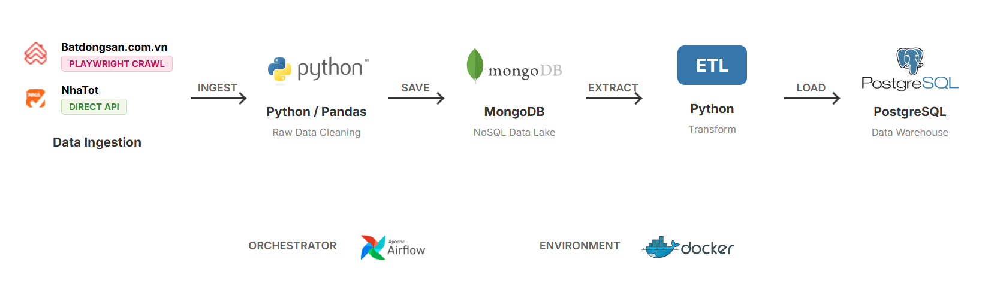
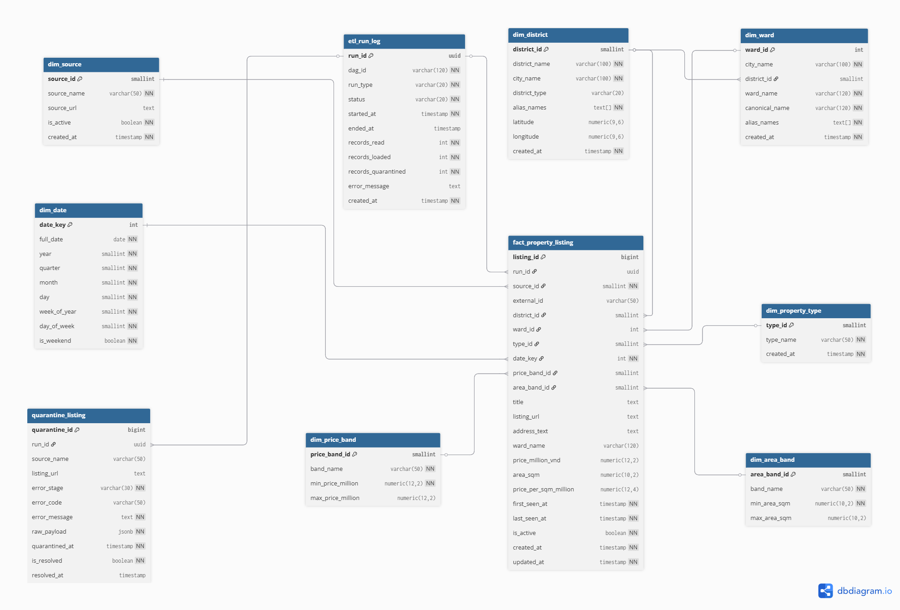

# Real Estate Data Pipeline & Data Warehouse (Hanoi Market)

## Project Overview
This project is an end-to-end **Data Engineering** solution designed to automate the process of collecting, processing, and storing real estate market data in Hanoi from the two largest sources in Vietnam: **batdongsan.com.vn** and **nhatot.com**.

The system automatically aggregates scattered data on listings, prices, areas, and geographic coordinates. The processed data is stored in a standardized **Data Warehouse**, ready for market trend analysis, property valuation, and building BI dashboards.

## Pipeline Architecture
The system follows a robust and modern ETL architecture:

1.  **Extract**: 
    *   **batdongsan.com.vn**: Uses an intelligent crawler (**Playwright**) with stealth techniques to bypass Cloudflare protection.
    *   **nhatot.com**: Uses direct **API** extraction for maximum speed and data accuracy.
2.  **Data Lake (Storage)**: Raw data (Raw JSON) is stored in **MongoDB**, providing flexibility for evolving data structures from different sources.
3.  **Transform**: Uses **Python & Pandas** to clean data, standardize addresses (handling diacritics and mapping to correct districts/wards), and calculate price and area bands.
4.  **Load**: Processed data is loaded into a **PostgreSQL Data Warehouse** using a Star Schema model.
5.  **Orchestrate**: The entire workflow is managed, scheduled, and monitored by **Apache Airflow** within a **Docker** environment.

### Data Pipeline Architecture

*Data flow diagram from Ingestion to Warehouse*

## Data Warehouse Schema (Star Schema)
To optimize querying and reporting, the Data Warehouse is modeled using a **Star Schema** centered around the property listing fact table.

**Key Tables:**
*   **Fact**: `fact_property_listing` (Stores core metrics: price, area, coordinates, dimension keys).
*   **Dimensions**: `dim_district`, `dim_ward`, `dim_property_type`, `dim_source`, `dim_date`.
*   **Quarantine**: `quarantine_listing` (Stores failed records for data quality control and debugging).

### Data Warehouse ERD


## Airflow Orchestration
**Apache Airflow** acts as the project's "brain," ensuring tasks are executed in the correct order with robust error handling.

The `real_estate_pipeline` DAG is structured to separate data flows for each source:
1.  **Crawl Tasks**: Parallel tasks crawl batdongsan.com.vn and nhatot.com to optimize execution time.
2.  **Load Tasks**: Triggered only after raw data is successfully landed in MongoDB. These tasks perform transformation and load data into the Data Warehouse.

## 🛠️ Technologies Used
*   **Programming Language**: Python 3.12
*   **Scraping & Crawling**: Playwright (with Stealth & Xvfb), Requests (API extraction).
*   **Data Processing**: Pandas, Pymongo, Psycopg2.
*   **Data Lake**: MongoDB (NoSQL).
*   **Data Warehouse**: PostgreSQL.
*   **Workflow Orchestration**: Apache Airflow.
*   **Infrastructure**: Docker & Docker Compose.
*   **OS Compatibility**: Windows (Local Dev) & Linux (Docker/Production with Xvfb).

## Getting Started

### Step 1: Clone the Repository
```bash
git clone https://github.com/kientrung2005/Real-Estate-Data-Pipeline.git
cd Real-Estate-Data-Pipeline
```

### Step 2: Configure Environment Variables
The system uses separate environment files for Local and Docker. Create them from the example:

*   **For Local execution (Python scripts)**:
    ```bash
    cp .env.example .env
    ```
*   **For Docker execution (Airflow & Database)**:
    ```bash
    cp .env.example .env.docker
    ```
*Open these files and update the connection details (Host, User, Password) according to your environment.*

### Step 3: Start the Infrastructure
Start the entire system using Docker Compose:

*Run Docker:
```bash
docker-compose up -d --build
```

### Step 4: Access the Services
Once the containers are ready, you can access the management interfaces via your browser:

*Open Airflow:
URL: [http://localhost:8080](http://localhost:8080)
Username: `admin`
Password: `admin123`

*Open PostgreSQL via Chrome (Adminer):
URL: [http://localhost:8081](http://localhost:8081)
Login Details:
System: `PostgreSQL`
Server: `postgres`
Username: `postgres`
Password: `admin123`
Database: `real_estate_db`

*Open MongoDB via Chrome (Mongo Express):
URL: [http://localhost:8082](http://localhost:8082)
Username: `admin`
Password: `password123`
MongoDB Authentication:
+Account: `admin`
+Password: `pass`
